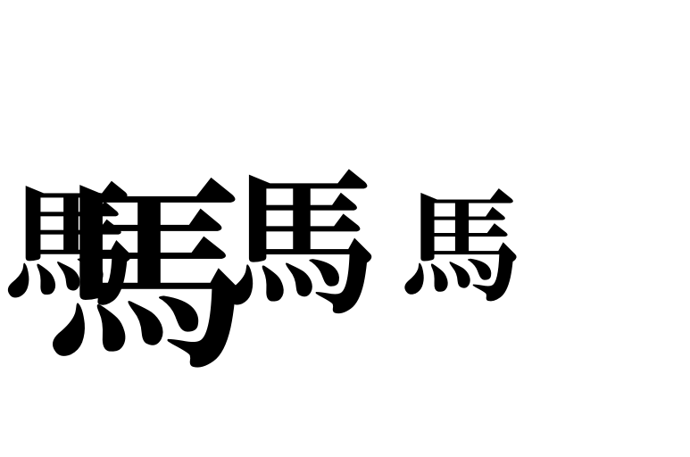
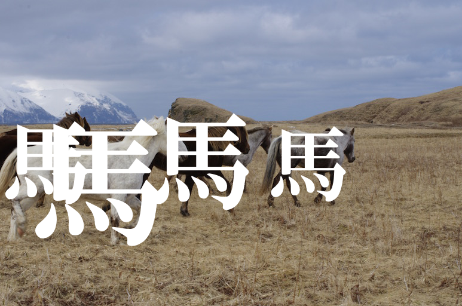
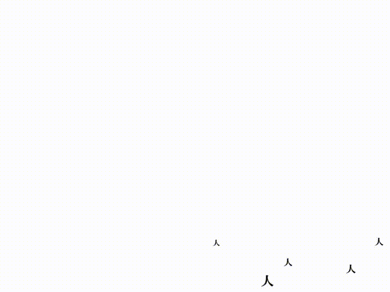

# YOLO in Japanese

not real-time

## Example 1

## Example 2 (Shibuya Crossing)

## Process

    in/*.png -----------+
      |                 |
      | darknet.py      |
      | (YOLOv3)        |
      v                 |
    in/result.txt ------+
                        |
                        | yj.rb
                        v
                      out/*.png

## Reference

YOLO: Real-Time Object Detection  
[https://pjreddie.com/darknet/yolo/](https://pjreddie.com/darknet/yolo/)
